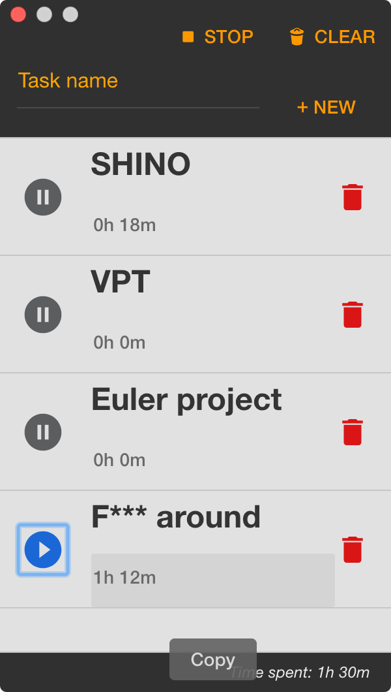

# task-tracker
Add task and track the progress  
  
NOTE: OSX supported only.  

## How to

I use yarn for dependencies managament.
```
# run
yarn install
yarn start

# dev
yarn install
yarn listen
yarn dev

# build OSX package
yarn dist --mac
```

Set the DEBUG environment variable to debug what electron-builder is doing:  

DEBUG=electron-builder,electron-builder:*  